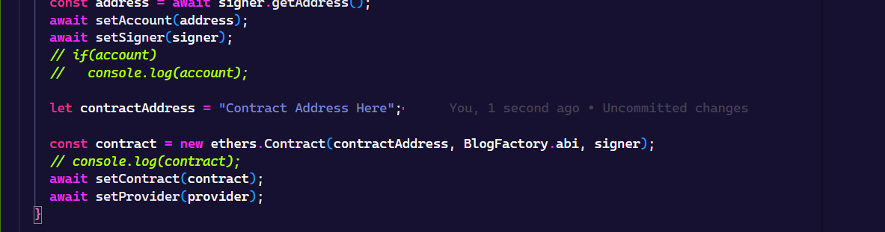

# Blogging Using Blockchain
A decentralized app (DApp) by which users can create and read blogs of other users of a network.

## Technologies/Frameworks Used
 - React JS
 - Solidity
 - MetaMask
 - Hardhat
 - Pinata

## Steps to run project
 - For [blogging folder(frontend)](./blogging)
    - Open terminal, then type the following commands
    ```shell
        cd blogging
        npm start
    ```
 - For deploying contracts and to get the adderss of deployed contract
    - Open terminal, then type the following commands
    ```shell
        npx hardhat run --network localhost scripts/deploy.js
    ```
    This will deploy your contract to an address and the address will be printed in the terminal.
    Copy the address and paste it in the [App.js](./blogging/src/App.js) file.

    
 
 - For getting account
    - Open terminal, then run the following command
    ```shell
        npx hardhat node
    ```
